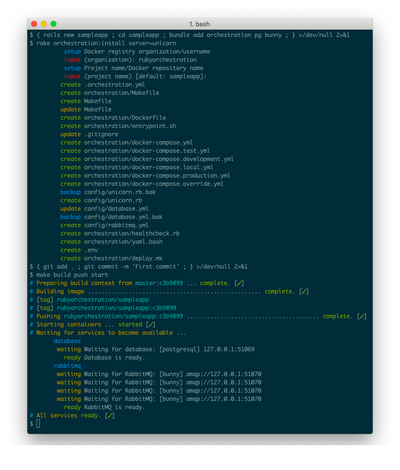

# Orchestration

_Orchestration_ aims to provide a convenient and consistent process for working with _Rails_ and _Docker_ without obscuring underlying components.

At its core _Orchestration_ is simply a `Makefile` and a set of `docker-compose.yml` files with sensible, general-purpose default settings. Users are encouraged to tailor the generated build-out to suit their application; once the build-out has been generated it belongs to the application.

A typical _Rails_ application can be tested, built, pushed to _Docker Hub_, and deployed to _Docker Swarm_ with the following commands:

```bash
make setup test build push
make deploy manager=user@swarm.example.com env_file=/var/configs/myapp.env
```

_Orchestration_ has been successfully used to build continuous delivery pipelines for numerous production applications with a wide range or requirements.

See [upgrade guide](UPGRADE.md) if you are upgrading from `0.5.x` to `0.6.x`.

## Example

The below screenshot demonstrates _Orchestration_ being installed in a brand new _Rails_ application with support for _PostgreSQL_ (via the _PG_ gem) and _RabbitMQ_ (via the _Bunny_ gem):


## Getting Started

[_Docker_](https://www.docker.com/get-started) and [_Docker Compose_](https://docs.docker.com/compose/install/) must be installed on your system.

### Install

Add _Orchestration_ to your `Gemfile`:

_Ruby 3.x_:

```ruby
gem 'orchestration', '~> 0.7.1'
```

_Ruby 2.x_:

```ruby
gem 'orchestration', '~> 0.6.7'
```

Install:

```bash
bundle install
```

### Setup

Generate configuration files and select your deployment server:

#### Generate build-out

```bash
rake orchestration:install server=unicorn # (or 'puma' [default], etc.)
```

To rebuild all build-out at any time, pass `force=yes` to the above install command.

You will be prompted to enter values for your _Docker_ organisation and repository name. For example, the _organisation_ and _repository_ for https://hub.docker.com/r/rubyorchestration/sampleapp are `rubyorchestration` and `sampleapp` respectively. If you are unsure of these values, they can be modified later by editing `.orchestration.yml` in the root of your project directory.

#### Configuration files

_Orchestration_ generates the following files where appropriate. Backups are created if a file is replaced.

* `config/database.yml`
* `config/mongoid.yml`
* `config/rabbitmq.yml` (see [RabbitMQ Configuration](#rabbitmq-configuration) for more details)
* `config/redis.yml` (see [Redis Configuration](#redis-configuration) for more details)
* `config/unicorn.rb`
* `config/puma.rb`

You may need to merge your previous configurations with the generated files. You will only need to do this once.

Test and development dependency containers bind to a randomly-generated [at install time] local port to avoid collisions. You may compare e.g. `orchestration/docker-compose.test.yml` with the `test` section of the generated `config/database.yml` to see how things fit together.

When setup is complete, add the generated build-out to _Git_:

```bash
git add .
git commit -m "Add Orchestration gem"
```

## Usage

All `make` commands provided by _Orchestration_ (with the exception of `test` and `deploy`) recognise the `env` parameter. This is equivalent to setting the `RAILS_ENV` environment variable.

e.g.:
```
# Stop all test containers
make stop RAILS_ENV=test
```

The default value for `env` is `development`.

As with any `Makefile` targets can be chained together, e.g.:
```
# Run tests, build, and push image
make setup test build push
```

### Containers

All auto-detected services will be added to the relevant `docker-compose.<environment>.yml` files at installation time.

#### Start services

```bash
make start
```

#### Stop services

```bash
make stop
```

#### Interface directly with `docker-compose`

```bash
$(make compose RAILS_ENV=test) logs -f database
```

### Images

Image tags are generated using the following convention:

```
# See .orchestration.yml for `organization` and `repository` values.
<organization>/<repository>:<git-commit-hash>

# e.g.
acme/anvil:abcd1234
```

#### Build an application image

Note that `git archive` is used to generate the build context. Any uncommitted changes will _not_ be included in the image.
```
make build
```

The `include` option can also be passed to provide a manifest file. Any files listed in this file will also be built into the _Docker_ image. Files **must** be located within the project directory.

```bash
make build include=manifest.txt
```

```bash
# manifest.txt
doc/api/swagger.json
doc/api/soap.xml
doc/api/doc.html
```

See also [build environment](#build-environment) if you use gems hosted on private _GitHub_/_Bitbucket_ repositories.

#### Push latest image

You must be logged in to a _Docker_ registry. Use the `docker login` command (see [Docker documentation](https://docs.docker.com/engine/reference/commandline/login/) for further reference).

```
make push
```

### Development

An [`.env` file](https://docs.docker.com/compose/env-file/) is created automatically in your project root. This file is _not_ stored in version control. Set all application environment variables in this file.

#### Launching a development server

To load all variables from `.env` and launch a development server, run the following command:

```bash
make serve
```

To load a _Rails_ console:
```bash
make console
```

The application environment will be output on launch for convenience.

To pass extra commands to the _Rails_ server:
```bash
# Custom server, custom port
make serve server='webrick -p 3001'

# Default server, custom port, custom bind address
make serve server='-p 3001 -b 192.168.0.1'
```

### Testing

A default `test` target is provided in your application's main `Makefile`. You are encouraged to modify this target to suit your application's requirements.

To launch all dependency containers, run database migrations, and run tests:
```bash
make setup test
```

The default `test` command can (and should) be extended. This command is defined in the root `Makefile` in the project and, by defaults, runs `rspec` and `rubocop`.

To skip the setup step and just run tests (i.e. once test containers are up and running and ready for use) simply run:

```bash
make test
```

Note that _Orchestration_ will wait for all services to become fully available (i.e. running and providing valid responses) before attempting to run tests. This is specifically intended to facilitate testing in continuous integration environments.

_(See [sidecar containers](#sidecar-containers) if you are running your test/development server inside _Docker_)_.

Dependencies will be launched and then tested for readiness. The retry limit and interval time for readiness tests can be controlled by the following environment variables:

```
ORCHESTRATION_RETRY_LIMIT # default: 15
ORCHESTRATION_RETRY_INTERVAL # default: 10 [seconds]
```

### (Local) Deployment

Run a deployment environment locally to simulate your deployment platform:

```bash
make deploy manager=localhost
```

Ensure you have passwordless _SSH_ access to your own workstation and that you have approved the host authenticity/fingerprint.

#### Deploy to a remote swarm

To connect via _SSH_ to a remote swarm and deploy, pass the `manager` parameter:
```bash
make deploy manager=user@manager.swarm.example.com
```

The file `orchestration/docker-compose.deployment.yml` is created automatically. This file will be used for all deployments, regardless of _Rails_ environment. Other environments should be configured using a separate [`.env` file](#env-file) for each environment. i.e. to deploy a staging environment, create a `staging.env` (for example), set `RAILS_ENV=staging` and run:
```bash
make deploy manager=user@manager.swarm.example.com env_file=staging.env
```

This way you can set different publish ports and other application configuration variables for each stage you want to deploy to.

#### Roll back a deployment

Roll back the `app` service of your stack:
```
make rollback manager=user@manager.swarm.example.com
```

Roll back a specific service:
```
make rollback manager=user@manager.swarm.example.com service=database
```

The `project_name` parameter is also supported.


#### Use a custom stack name

The [_Docker_ stack](https://docs.docker.com/engine/reference/commandline/stack/) name defaults to the name of your repository (as defined in `.orchesration.yml`) and the _Rails_ environment, e.g. `anvil_staging`.

To override this default, pass the `project_name` parameter:
```
make deploy project_name=custom_stack_name
```

This variable will also be available as `COMPOSE_PROJECT_NAME` for use within your `docker-compose.yml`. e.g. to explicitly name a network after the project name:

```yaml
networks:
  myapp:
    name: "${COMPOSE_PROJECT_NAME}"
```

#### Use a custom `.env` file
<a name="env-file"></a>

Specify a path to a local `.env` file (see [Docker Compose documentation](https://docs.docker.com/compose/environment-variables/#the-env-file)):
```
make deploy env_file=/path/to/.env
```

Note that the following two variables _must_ be set in the relevant `.env` file (will look in the current working directory if no path provided):

```
# Published port for your application service:
PUBLISH_PORT=3000

# Number of replicas of your application service:
REPLICAS=5
```

It is also recommended to set `SECRET_KEY_BASE`, `DATABASE_URL` etc. in this file.

## Logs

The output from most underlying components is hidden in an effort to make continuous integration pipelines clear and concise. All output is retained in `log/orchestration.stdout.log` and `log/orchestration.stderr.log`. i.e. to view all output during a build:

```bash
tail -f log/orchestration*.log
```

A convenience `Makefile` target `dump` is provided. The following command will output all consumed _stdout_, _stderr_, and _Docker Compose_ container logs for the test environment:

```bash
make dump RAILS_ENV=test
```

All commands also support the `verbose` flag which will output all logs immediately to the console:
```bash
make build verbose=1
```

<a name="build-environment"></a>
## Build Environment

The following environment variables will be passed as `ARG` variables when building images:

```
BUNDLE_BITBUCKET__ORG
BUNDLE_GITHUB__COM
```

Set these variables in your shell if your `Gemfile` references privately-hosted gems on either _Bitbucket_ or _GitHub_.

See related documentation:

* https://help.github.com/articles/creating-a-personal-access-token-for-the-command-line/
* https://confluence.atlassian.com/bitbucket/app-passwords-828781300.html

## Healthchecks

[Healthchecks](https://docs.docker.com/engine/reference/builder/#healthcheck) are automatically configured for your application. A healthcheck utility is provided in `orchestration/healthcheck.rb`. The following environment variables can be configured (in the `app` service of `orchestration/docker-compose.deployment.yml`):

| Variable | Meaning | Default Value |
|-|-|-|
| `WEB_HOST` | Host to reach application (from inside application container) | `localhost` |
| `WEB_PORT` | Port to reach application (from inside application container) | `8080` |
| `WEB_HEALTHCHECK_PATH` | Path expected to return a successful response | `/` |
| `WEB_HEALTHCHECK_READ_TIMEOUT` | Number of seconds to wait for data before failing healthcheck | `10` |
| `WEB_HEALTHCHECK_OPEN_TIMEOUT` | Number of seconds to wait for connection before failing healthcheck | `10` |
| `WEB_HEALTHCHECK_SUCCESS_CODES` | Comma-separated list of HTTP status codes that will be deemed a success | `200,201,202,204` |

If your application does not have a suitable always-available route to use as a healthcheck, the following one-liner may be useful:

```ruby
# config/routes.rb
get '/healthcheck', to: proc { [200, { 'Content-Type' => 'text/html' }, ['']] }
```

In this case, `WEB_HEALTHCHECK_PATH` must be set to `/healthcheck`.

## Dockerfile

A `Dockerfile` is automatically generated based on detected dependencies, required build steps, _Ruby_ version, etc.

Real-world applications will inevitably need to make changes to this file. As with all _Orchestration_ build-out, the provided `Dockerfile` should be treated as a starting point and customisations should be applied as needed.

## Entrypoint

An [entrypoint](https://docs.docker.com/engine/reference/builder/#entrypoint) script for your application is provided at `orchestration/entrypoint.sh` which does the following:

* Runs the `CMD` process as the same system user that launched the container (rather than the default `root` user);
* Creates various required temporary directories and removes stale `pid` files;
* Adds a route `host.docker.internal` to the host machine running the container (mimicking the same route provided by _Docker_ itself on _Windows_ and _OS
  X_).

<a name="sidecar-containers"></a>
## Sidecar Containers

If you need to start dependency services (databases, etc.) and connect to them from a _Docker_ container (an example use case of this would be running tests in _Jenkins_ using its _Docker_ agent) then the container that runs your tests must join the same _Docker_ network as your dependency services.

To do this automatically, pass the `sidecar` parameter to the `start` or `test` targets:

```bash
make setup test sidecar=1
```

When running in sidecar mode container-to-container networking is used so there is no benefit to binding dependency containers to a specific port on the host machine (only the target port will be used). For this reason a random, ephemeral port (chosen by _Docker_) will be used to allow multiple instances of each dependency to run alongside one another.

The _Docker Compose_ project name (and derived network name) is also suffixed with a random token to avoid container/network name conflicts.

Note that a temporary file `orchestration/.sidecar` containing the random project name suffix will be created when sidecar mode is used. If this file exists then sidecar mode is always assumed to be _on_. This is to allow (e.g.) stopping services that have been started separately with another command, for example:

```bash
# Start dependencies and run tests in sidecar mode
make setup test sidecar=1

# Stop test dependencies in sidecar mode
make stop RAILS_ENV=test
```

<a name="rabbitmq-configuration"></a>
## RabbitMQ Configuration

The [Bunny](https://github.com/ruby-amqp/bunny) _RabbitMQ_ gem does not recognise `config/rabbitmq.yml` or `RABBITMQ_URL`. If your application uses _RabbitMQ_ then you must manually update your code to reference this file, e.g.:

```ruby
connection = Bunny.new(config_for(:rabbit_mq)['url'])
connection.start
```

_Orchestration_ generates the following `config/rabbitmq.yml`:

```
development:
  url: amqp://127.0.0.1:51070
  management_url: http://127.0.0.1:5069

test:
  url: amqp://127.0.0.1:51068
  management_url: http://127.0.0.1:5067

production:
  url: <%= ENV['RABBITMQ_URL'] %>
  management_url: <%= ENV['RABBITMQ_MANAGEMENT_URL'] %>
```

Using this approach, the environment variable `RABBITMQ_URL` can be used to configure _Bunny_ in production (similar to `DATABASE_URL` and `MONGO_URL`).

This is a convention of the _Orchestration_ gem intended to make _RabbitMQ_ configuration consistent with other services.

<a name="redis-configuration"></a>
## Redis Configuration

The [Redis](https://github.com/redis/redis-rb) does not recognise `config/redis.yml`. If your application uses _Redis_ then you must manually update your code to reference this file, e.g.:

```ruby
# config/initializers/redis.rb

ENV['REDIS_URL'] ||= config_for(:redis)['url']
```

_Redis_ will then use `REDIS_URL` for all connections.

_Orchestration_ generates the following `config/redis.yml`:

```
development:
  url: redis://127.0.0.1:51071

test:
  url: redis://127.0.0.1:51069
```

This allows `development` and `test` environments to auto-load the correct config for the relevant containers while also allowing `production` to use either the auto-generated _Redis_ service or an external _Redis_ instance.

## Alternate Database Configuration Files

If you have multiple databases configured in various `config/database.*.yml` files then the `make wait` command will automatically detect database configurations.

If a service `database-example` is included in the relevant _Docker Compose_ configuration then `config/database.example.yml` will be used to load the connection configuration. Note that the service name _must_ begin with `database-`.

## License

[MIT License](LICENSE)

## Contributing

Feel free to make a pull request. Use `make test` to ensure that all tests, _Rubocop_ checks, and dependency validations pass correctly.
